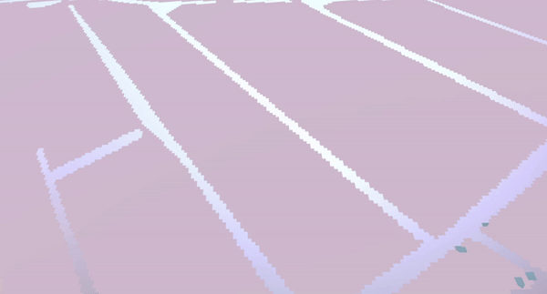

[](https://github.com/psf/black)
[](https://github.com/Deltares/netcdf_to_gltf_converter/actions/workflows/build.yml)
[](https://sonarcloud.io/dashboard?id=Deltares_netcdf_to_gltf_converter)

# Contents

- [Contents](#contents)
- [Disclaimer](#disclaimer)
- [NetCDF to glTF converter](#netcdf-to-gltf-converter)
  - [Why use glTF](#why-use-gltf)
  - [Supported models](#supported-models)
- [User guide](#user-guide)
  - [Requirements](#requirements)
  - [Installation](#installation)
  - [Usage](#usage)
  - [Configuration file](#configuration-file)
  - [Logging](#logging)
  - [View results](#view-results)
- [Methodology](#methodology)
- [Limitations](#limitations)
- [Contributing](#contributing)
- [Acknowledgments](#acknowledgments)

# Disclaimer

This tool is a proof-of-concept, which means it has been tested in a limited scope and may not handle all real-world cases effectively. As many cases have not been validated, conversion may fail in certain scenarios.

# NetCDF to glTF converter

This is a tool that converts hydrodynamical model output results that are stored in the netCDF file format to the glTF file format. The goal is to allow users to view their data in 3D renderers using the glTF format.

<p align="center">
  
</p>

## Why use glTF
[glTF (GL Transmission Format)](https://www.khronos.org/gltf/) is an open-standard file format developed by [The Khronos Group](https://www.khronos.org/). The glTF file format is used for 3D scenes and models designed for efficient transmission and loading of 3D content on the web and other real-time applications. This file format can store geometry, materials, textures, animations, and other scene data.
glTF is used in a variety of industries and applications, including gaming, virtual and augmented reality, education, and more. It is particularly well-suited for web-based applications, as it allows 3D content to be easily and efficiently delivered over the internet, and can be rendered in real-time on a wide range of devices. 

## Supported models

Currently, this tool supports the conversion of the following hydrodynamical models:

- D-HYDRO (map)
- XBEACH

# User guide
## Requirements
- Python >=3.9, <3.12
- Poetry >=1.4.2 

## Installation
To install the converter, follow these steps:

1. Install dependency manager [Poetry](https://python-poetry.org/docs/):

**Windows (PowerShell)**
```
(Invoke-WebRequest -Uri https://install.python-poetry.org -UseBasicParsing).Content | python -
```

**Linux, macOS, Windows (WSL)**
```
curl -sSL https://install.python-poetry.org | python3 -
```
2. Clone or [download](https://github.com/Deltares/netcdf_to_gltf_converter/archive/refs/heads/main.zip) this repository to your local machine
3. From the root folder, open your command line interface and run the following command:
```
poetry install
```

These steps will ensure that the converter is installed within a virtual environment (`.venv`) and you can start calling the converter script.

## Usage
 After following the installation steps, the converter can be used from the command line. 
 Three arguments should be passed to the converter script.
1. The path to the source netCDF file. Only files with the following conventions are supported: `CF-1.8 UGRID-1.0 Deltares-0.10`
2. The path to the target glTF file. A glTF file uses one of two possible file extensions: .gltf (JSON/ASCII) or .glb (binary). If the path already exists it will be overwritten. 
3. The path to the configuration JSON file.

**Example**
 ```
 poetry run python netcdf_to_gltf_converter\converter_cli.py input_map.nc output.gltf config.json
 ```
 
## Configuration file
 The configuration JSON file allows you to customize various settings and parameters for the conversion process. It provides flexibility in defining how the netCDF data is transformed into the glTF format. 
 
- `file_version`: Specifies the version of the configuration file format.

- `model_type`: A string value indicating the model type used for the generation of the netCDF file. Supported options: `D-HYDRO`, `XBEACH`.

- `time_index_start`: An integer value specifying the starting index of the time steps to be converted. This allows you to specify a subset of time steps from the netCDF file. 

- `time_index_end` (optional): An integer value specifying the end index of the time steps to be converted. When this option is not specified, the converter will include all time steps from the time step with index `time_index_start` to the last time step in the original dataset.

- `times_per_frame`: An integer value specifying the number of time steps to be included in each frame of the glTF animation. This option is useful if you want to adjust the time resolution of the animation.

- `shift_coordinates` (optional): A value indicating how to shift the coordinates of the data during conversion. When set to `min`, the converter will shift the coordinates such that the smallest x and y become the origin (0,0); variable values remain unchanged. It is also possible to provide custom shift values for the x- and y-coordinates and the variable values (z-coordinates):

  - `crs_transformation` (optional): The configuration settings for transforming the provided shift values from one coordinate system to another. The target coordinate system should be the coordinate system of the model.
    - `source_epsg`: EPSG code of the source coordinate system.
    - `target_epsg`: EPSG code of the target coordinate system.
  - `shift_x`: A floating value containing the value that should be subtracted from all x-coordinates.
   - `shift_y`: A floating value containing the value that should be subtracted from all y-coordinates.
   - `shift_z`: A floating value containing the value that should be subtracted from all variable values (z-coordinates).

- `scale_horizontal`: A floating value indicating the scale factor for the x- and y-coordinates. It determines the scaling of the converted geometry. A value of 1.0 results in the original geometry size.

- `scale_vertical`: A floating value indicating the scale factor for the data values. It determines the scaling of the converted geometry. A value of 1.0 results in the original geometry size.

- `variables`: An array containing the configurations for each variable to be converted. Each variable configuration consists of the following options:
  
  - `name`: The name of the variable as it appears in the netCDF file.
  
  - `color`: An array representing the color of the rendered variable in the glTF model. The color values should be in the range of 0.0 to 1.0 for each channel (red, green, blue, alpha).
  
  - `metallic_factor`: A floating-point value between 0.0 and 1.0 defining the degree of metallicity or non-metallicity of the mesh material. A value of 0.0 represents a non-metallic surface, while a value of 1.0 indicates a fully metallic surface.
  
  - `roughness_factor`: A floating-point value between 0.0 and 1.0 defining the smoothness or roughness of the mesh material. A roughness value of 0.0 represents a perfectly smooth surface with sharp reflections, while a value of 1.0 indicates a completely rough surface with scattered reflections.
  
  - `use_threshold`: A boolean value indicating whether to apply a threshold to the variable data. When set to `true`, the converter will add a threshold mesh to on the specified threshold height to distinguish between variable values above and below this height. When a scaling factor is applied to the conversion, this height will also be multiplied by this factor. 
  
  - `threshold_height` (optional): The threshold height value used to distinguish between variable values above and below this value. This option is only required when `use_threshold` is `true`.
  
  - `threshold_color` (optional): An array containg four floating values representing the color of the threshold mesh. The color values should be in the range of 0.0 to 1.0 for each channel (red, green, blue, alpha). This option is only required when `use_threshold` is `true`.
 
 **Example**
```json
{
   "file_version":"0.1.0",
   "model_type": "D-HYDRO",
   "time_index_start": 50,
   "time_index_end": 100,
   "times_per_frame": 3,
   "shift_coordinates": "min",
   "scale_horizontal": 0.5,
   "scale_vertical": 0.5,
   "variables":[
      {
         "name": "Mesh2d_waterdepth",
         "color": [0.372, 0.635, 0.8, 1.0],
         "metallic_factor": 0.0,
         "roughness_factor": 0.15,
         "use_threshold": false,
         "threshold_height": 0.01,
         "threshold_color": [1.0, 1.0, 1.0, 1.0]
      },
      {
         "name": "Mesh2d_s1",
         "color": [0.686, 0.831, 0.937, 1.0],
         "metallic_factor": 0.0,
         "roughness_factor": 0.15,
         "use_threshold": false
      }
   ]
}
```

In the above example, we render two variables from a D-HYDRO output map netCDF file: `Mesh2d_waterdepth` and `Mesh2d_s1`. For the animation we take a subset of the time steps. The animation will start at time step with index 50 and will end at time step with index 100. The animation will have a resolution of 3 time steps. Additionally, we apply a coordinate shift to ensure that the meshes have an origin at (0,0). Furthermore, we set the scale for both the horizontal and vertical directions to 0.5, resulting in a reduction of size in all directions by a factor of two. 

For the `Mesh2d_waterdepth` variable, an additional threshold mesh is rendered at a height of 0.01. Each mesh is assigned its own color, specified by the normalized red, green, blue and alpha (RGBA) values.

## Logging
During conversion, a log file is written to the output folder (folder of the resulting glTF file) with the name: `gltf_converter_<date>_<time>_<gltf-name>.log`

## View results
 Several glTF viewers exist that can be used to view the produced glTF file. Simply drag and drop the file, and the glTF file will be rendered.
 * [glTF Sample Viewer](https://github.khronos.org/glTF-Sample-Viewer-Release/)
 * [Babylon.js Sandbox](https://sandbox.babylonjs.com/)

# Methodology
The converter operates through the following steps:
1. If specified in the configuration file, the x- and y-coordinates and possibly z-coordinates (variable values) are shifted such that the dataset contains an origin point.
2. If specified in the configuration file, the geometry is scaled with the desired scaling factor.
3. The 2D grid from the netCDF file is triangulated, allowing it to be passed to glTF. In order to render a mesh, glTF requires a geometry definition that consists of triangles.
4. For each specified variable in the configuration file:
   1. The data point locations for the variable are retrieved as x- and y-coordinates. Variables from the netCDF file can be defined on either cell nodes, edges or faces.
   2. For the first time step:
      1. The data points are interpolated onto the nodes of the grid.
      2. The geometry of the interpolated variable data is defined as the base mesh geometry for glTF.
   3. For each subsequent time step:
      1. The data points are interpolated onto the nodes of the grid.
      2. With the interpolated variable data, the value displacements are calculated with respect to the base mesh geometry, allowing it to be animated.
   4. For each created mesh geometry, the specified color for this variable in the configuration file is applied.
   5. If specified in the configuration file, an addtional static threshold mesh with the desired color is created. The mesh geometry will consist of the same x- and y- coordinates as the first mesh, but with the desired fixed height. 

<p align="center">
  
</p>

8. The glTF data is exported to the user-defined glTF file.

By following these steps, the converter is able to take netCDF files containing time and location dependent data and convert the data into glTF files that can be used to view the data in 3D renderers.

# Limitations
**Color animation**

In theory, glTF does support the animation of colors, allowing for dynamic and engaging visual effects. However, it's important to note that [this feature is optional](https://registry.khronos.org/glTF/specs/2.0/glTF-2.0.html#morph-targets) and not all glTF viewers or software implementations can effectively handle it. As a result, the practical use and compatibility of color animation in glTF is limited, as many viewers lack the necessary support. Until glTF makes this feature required or more viewers support this feature, the meshes in the rendered glTF will have a uniform color. As a result, the rendered meshes will have a uniform color until this feature becomes required or more viewers provide support for it.

**Performance**

Currently, the converter's performance is suboptimal, especially when dealing with larger datasets that contain many locations and/or time steps. In such scenarios, it may encounter challenges in efficiently processing and delivering the glTF file. Performance improvements will be introduced in the long term.

**Accuracy interpolation**

The converter currently uses nearest point interpolation, which is a basic method for interpolating the data onto the vertices. However, in the future, the converter aims to offer additional interpolation methods. This would allow the user to choose the most suitable interpolation method for their dataset.

# Contributing
If you encounter any issues or have good ideas for this project please [create an issue](https://github.com/Deltares/netcdf_to_gltf_converter/issues/new/choose). This will help improve the project. Before creating any new issues, please check the [backlog](https://github.com/Deltares/netcdf_to_gltf_converter/issues) to see if your issue already exists. 

# Acknowledgments
[Connec2](https://connec2.nl/) is a company specialized in cross reality (XR) technology that guided us to setup this project. 

This tool was initially developed as part of the [D-HYDRO GUI Visualisatie & Cloud project](https://tkideltatechnologie.invoermodule.nl/project/d-hydro-gui-visualisatie-cloud/), which was funded by the fifth Top consortium for Knowledge and Innovation (TKI) programme.


