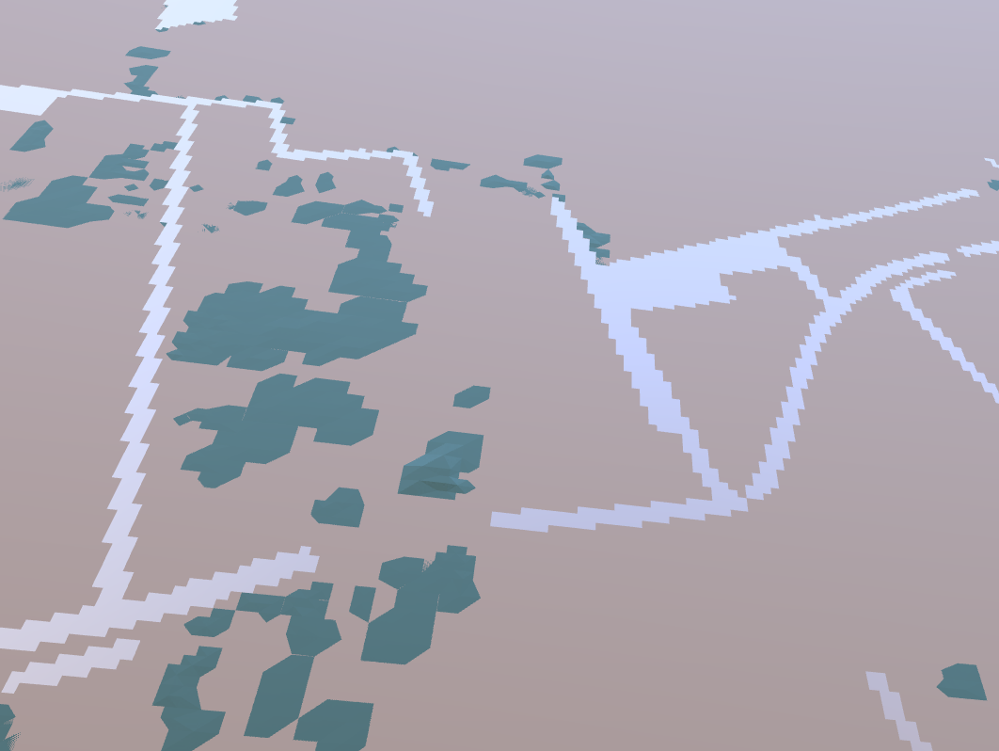

[](https://github.com/psf/black)
[](https://github.com/Deltares/netcdf_to_gltf_converter/actions/workflows/build.yml)
[](https://sonarcloud.io/dashboard?id=Deltares_netcdf_to_gltf_converter)

# Contents

1. [D-HYDRO NetCDF output to glTF converter](#intro)
    1. [Why use glTF](#why-gltf)
    2. [How it works](#how-it-works)
2. [User guide](#user-guide)
    1. [Requirements](#requirements)
	2.	[Installation](#installation)
	3.	[Usage](#usage)
	4.	[View results](#view-results)
3. [Contributing](#contributing)
4. [Acknowledgements](#acknowledgements)

# D-HYDRO NetCDF output to glTF converter <a name="intro"></a>

This is a tool that converts D-HYDRO map output results that are stored in the NetCDF file format to the glTF file format. The goal is to allow users who work with D-HYDRO results to view their data in 3D renderers using the glTF format.

Currently, the tool is focused on converting the water depth data from the map results. Other variables are not supported yet.

<p align="center">
  
</p>

## Why use glTF <a name="why-gltf"></a>
glTF (GL Transmission Format) is an open-standard file format developed by The Khronos Group. The glTF file format is used for 3D scenes and models designed for efficient transmission and loading of 3D content on the web and other real-time applications. This file format can store geometry, materials, textures, animations, and other scene data.
glTF is used in a variety of industries and applications, including gaming, virtual and augmented reality, education, and more. It is particularly well-suited for web-based applications, as it allows 3D content to be easily and efficiently delivered over the internet, and can be rendered in real-time on a wide range of devices. 

## How it works <a name="how-it-works"></a>
The converter operates through the following steps:

1. The 2D grid from the user-defined NetCDF file is triangulated, allowing it to be passed to glTF. In order to render a mesh, glTF requires a geometry definition that consists of triangles.
2. The variable with the standard name `sea_floor_depth_below_sea_surface` is loaded from the NetCDF file.
3. The data locations for the variable are determined as x- and y-coordinates.
4. For the first time step:
   * The variable data is interpolated onto the vertices of the grid.
   * The interpolated variable data is defined as the base mesh for glTF.
5. For each subsequent time step:
   * The variable data is interpolated onto the vertices of the grid.
   * With the interpolated variable data, the water depth displacements are calculated with respect to the base mesh, allowing it to be animated.
6. From the derived geometries, a blue mesh is built for glTF.
7. In addition to the blue mesh that renders the variable data, a static white mesh with a height of 0.01 is built. This is done to provide a clear visual distinction between dry and wet cells, which have depths <= 0.01 and > 0.01, respectively.

<p align="center">
  
</p>

8. The glTF data is exported to the user-defined glTF file.

By following these steps, the converter is able to take NetCDF files containing water depth data and convert the data into glTF files that can be used to view the data in 3D renderers. While the tool is currently focused on converting water depth data, it may be expanded to support other variables in the future.

# User guide <a name="user-guide"></a>
## Requirements
- Python >=3.9, <3.12
- Poetry >=1.4.2 

## Installation <a name="installation"></a>
To install the converter, follow these steps:

1. Install dependency manager [Poetry](https://python-poetry.org/docs/):

**Windows (PowerShell)**
```
(Invoke-WebRequest -Uri https://install.python-poetry.org -UseBasicParsing).Content | python -
```

**Linux, macOS, Windows (WSL)**
```
curl -sSL https://install.python-poetry.org | python3 -
```
2. Clone or [download](https://github.com/Deltares/netcdf_to_gltf_converter/archive/refs/heads/main.zip) this repository to your local machine
3. From the root folder, open your command line and execute:
```
poetry install
```

These steps will ensure that the converter is installed within a virtual environment (`.venv`) and you can start calling the converter script.

## Usage <a name="usage"></a>
 After following the installation steps, the converter can be used from the command line. 
 Two arguments should be passed to the converter script.
1. The path to the source NetCDF file. Only files with the following conventions are supported: `CF-1.8 UGRID-1.0 Deltares-0.10`
2. The path to the target glTF file. If the path already exist it will be overwritten.
 
**Example**
 ```
 poetry run python input_map.nc output.gltf
 ```
 
## View results <a name="view-results"></a>
 Several glTF viewers exist that can be used to view the produced glTF file. Simply drag and drop the file, and the glTF file will be rendered.
 * [glTF Sample Viewer](https://github.khronos.org/glTF-Sample-Viewer-Release/)
 * [Babylon.js Sandbox](https://sandbox.babylonjs.com/)

# Contributing <a name="contributing"></a>
If you encounter any issues or have good ideas for this project please [create an issue](https://github.com/Deltares/netcdf_to_gltf_converter/issues/new/choose). This will help improve the project. Before creating any new issues, please check the [backlog](https://github.com/Deltares/netcdf_to_gltf_converter/issues) to see if your issue already exists. 

# Acknowledgments <a name="acknowledgements"></a>
[Connec2](https://connec2.nl/) is a company specialized in cross reality (XR) technology that guided us to setup this project. 

This tool was developed as part of the fifth [Top consortium for Knowledge and Innovation (TKI) programme](https://www.tkiwatertechnologie.nl/).

